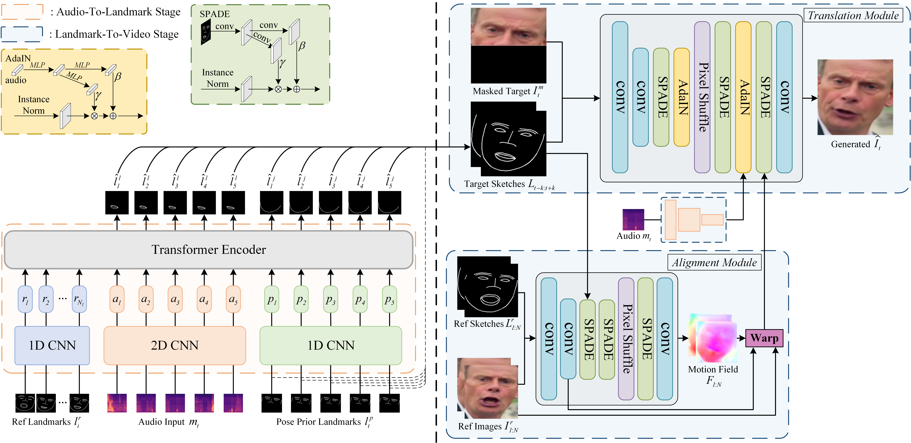

# IP_LAP: Identity-Preserving Talking Face Generation with Landmark and Appearance Priors （CVPR 2023）

Pytorch official implementation for our CVPR2023 paper "**I**dentity-**P**reserving Talking Face Generation with **L**andmark and **A**ppearance **P**riors".



TODO:
- [x] Demo videos
- [x] pre-trained model
- [x] code for testing
- [x] code for training
- [x] code for preprocess dataset
- [x] guideline 
- [x] arxiv paper release

[[Paper]](https://arxiv.org/abs/2305.08293) [[Demo Video]](https://youtu.be/wtb689iTJC8)

## Requirements
- Python 3.7.13
- torch 1.10.0
- torchvision 0.11.0
- ffmpeg

We conduct the experiments with 4 24G RTX3090 on CUDA 11.1. For more details, please refer to the `requirements.txt`. We recommend to install [pytorch](https://pytorch.org/) firstly, and then run:
```
pip install -r requirements.txt
```
## Test
Download the pre-trained models from [OneDrive](https://1drv.ms/f/s!Amqu9u09qiUGi7UJIADzCCC9rThkpQ?e=P1jG5N) or [jianguoyun](https://www.jianguoyun.com/p/DeXpK34QgZ-EChjI9YcFIAA), and place them to the folder `test/checkpoints` . Then run the following command:
```
CUDA_VISIBLE_DEVICES=0 python inference_single.py
```
To inference on other videos, please specify the `--input` and `--audio` option and see more details in code.

The evaluation code is similar to [this repo](https://github.com/dc3ea9f/vico_challenge_baseline/tree/a282472ea99a1983ca2ce194665a51c2634a1416/evaluations).
## Train
### download LRS2 dataset
Our models are trained on LRS2. Please go to the [LRS2](https://www.robots.ox.ac.uk/~vgg/data/lip_reading/lrs2.html) website to download the dataset. LRS2 dataset folder structure is following:
```
data_root (mvlrs_v1)
├── main, pretrain (we use only main folder in this work)
|	├── list of folders
|	│   ├── five-digit numbered video IDs ending with (.mp4)
```
`main folder` is the `lrs2_video` mentioned below.

### preprocess the audio
extract the raw audio and Mel-spectrum feature from video files by running: 
```
CUDA_VISIBLE_DEVICES=0 python preprocess_audio.py --data_root ....../lrs2_video/ --out_root ..../lrs2_audio
```
### preprocess the videos' face 

extract the cropped face, landmarks and sketches from video files by running: 

```
CUDA_VISIBLE_DEVICES=0 python preprocess_video.py --dataset_video_root ....../lrs2_video/ --output_sketch_root ..../lrs2_sketch --output_face_root ..../lrs2_face --output_landmark_root ..../lrs2_landmarks
```

### train Landmark generator

train the landmark generator network by running:

```
CUDA_VISIBLE_DEVICES=0 python train_landmarks_generator.py --pre_audio_root ..../lrs2_audio --landmarks_root ..../lrs2_landmarks
```
The models are trained until the eval_L1_loss no longer decreases (about 6e-3).
Under the default batchsize setting on a single RTX 3090, our model stopped at epoch 1837(610k iteration) with eval_L1_loss 5.866 e-3, using no more than one day.

### train Video Renderer
Training for the video renderer is similar (on four RTX 3090). Train it until the FID no longer decreases (about 20 or less).
train the video renderer network by running:
```
CUDA_VISIBLE_DEVICES=0,1,2,3 python train_video_renderer.py --sketch_root ..../lrs2_sketch --face_img_root ..../lrs2_face  --audio_root ..../lrs2_audio
```
Note that the translation module will only be trained  after 25 epochs, thus the fid and running_gen_loss will only decrease after epoch 25. 


## Acknowledgement
This project is built upon the publicly available code [DFRF](https://github.com/sstzal/DFRF) , [pix2pixHD](https://github.com/NVIDIA/pix2pixHD), [vico_challenge](https://github.com/dc3ea9f/vico_challenge_baseline/tree/a282472ea99a1983ca2ce194665a51c2634a1416/evaluations) and [Wav2Lip](https://github.com/Rudrabha/Wav2Lip/tree/master). Thank the authors of these works for making their excellent work and codes publicly available.


## Citation and Star
Please cite the following paper and star this project if you use this repository in your research. Thank you!
```
@InProceedings{Zhong_2023_CVPR,
    author    = {Zhong, Weizhi and Fang, Chaowei and Cai, Yinqi and Wei, Pengxu and Zhao, Gangming and Lin, Liang and Li, Guanbin},
    title     = {Identity-Preserving Talking Face Generation With Landmark and Appearance Priors},
    booktitle = {Proceedings of the IEEE/CVF Conference on Computer Vision and Pattern Recognition (CVPR)},
    month     = {June},
    year      = {2023},
    pages     = {9729-9738}
}
```


